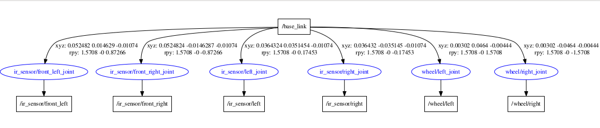

# **doogie_description**

This ROS catkin package provides the ros controllers interface in order to controll **Doogie Mouse** platform.

**Keywords:** Micromouse, IEEE, ROS

**Author: [Caio Amaral] 
Affiliation: [BIR - Brazilian Institute of Robotics] 
Maintainer: Caio Amaral, caioaamaral@gmail.com**

### Supported Versions

The **doogie_description** package has been tested under [ROS] Kinetic and Ubuntu 16.04 using **Gazebo 7.0.0** (the one that comes with [ROS] Kinetic Desktop-full installation). 

<!--  TODO -->

   

 

## Dependencies 
- [robot_state_publisher] (publish the state of a robot to [tf]),
- [urdf] (controller for differential drive wheel systems),
- [xacro] (an XML macro language used to simplify URDF file construction);

# **Table of Contents**
- [**doogie_description**](#doogiedescription)
    - [Supported Versions](#supported-versions)
  - [Dependencies](#dependencies)
- [**Table of Contents**](#table-of-contents)
- [**Robot URDF**](#robot-urdf)
    - [Core Xacros](#core-xacros)
    - [Acessories Xacros](#acessories-xacros)
    - [Arguments](#arguments)
- [Mazes Available](#mazes-available)
- [**Launch files**](#launch-files)
- [**Parameters**](#parameters)

 

# **Robot URDF**

[Doogie Mouse URDF](/doogie_description/urdf) desing is [xacro] oriented, so it's subdivided in macros submodules designated for each aspect of the robot. They are subdivided in core xacros and acessories xacros:

### 1. Core Xacros

1. **common_properties.xacro:** 
   - defines some rviz **colors**;
2. **doogie_base.xacro:** 
   - the macro for generating Doogie Mouse **base plat**;
3. **doogie_sensors.xacro:**
   - the macro for generating **all sensors** used by Doogie Mouse, each sensor is defined in the xacros files located in [acessories](/doogie_description/urdf/acessories) folder.
4. **doogie_wheels.xacro:** 
   - the macro for generating **wheels**.

### 2. Acessories Xacros

1. **ir_sensor.xacro:** 
   - the macro for generating the **ir sensor** used by Doogie Mouse. 

### 3. Arguments

Doogie Mouse URDF also can be modified by passing it arguments by launchfiles (e.g [robot_description.launch](doogie_description/launch/robot_description.launch)) such as:

1. **namespace**

   - defines a namespace which will be appended to each link name.
  
2. **robotParam**
   
   - defines the parameter name where que robot description will be loaded.

# Mazes Available

   - **Minus** [10x10 Modified IEEE pattern] 

# **Launch files**

1. **robot_description.launch:** load Doogie Mouse robot description parameter.

     - **Arguments to set robot_description**

       - **`robot_namespace:`** specifie the robot URDF namespace.
      
          - Default: `/`
           
       - **`robot_param:`** specifie de parameter name in which will be loaded the robot description.
       
          - Default: `robot_description` 

2. **maze_description:** load some Doogie Mouse's maze description parameter.
   
     - **Arguments to set maze_description**
      
       - **`maze_name:`** set wich maze will be loaded.
         
          - Default: `minus`  

3. **robot_display:** Display Doogie Mouse in Rviz.
   
     - **Arguments to set robot_display**
      
       - **`rvizconfig:`** set wich Rviz setup will be loaded.
         
          - Default: `$(find doogie_description)/rviz/display.rviz`

 

# **Parameters**

- **`robot_description`**

	The name of the robot description parameter.

- **`maze_description`**

    The name of the maze description parameter.

[controller_manager]: https://wiki.ros.org/controller_manager

[diff_drive_controller]: https://wiki.ros.org/diff_drive_controller

[doogie_description]:  https://github.com/Brazilian-Institute-of-Robotics/doogie_description

[doogie_description]:  https://github.com/Brazilian-Institute-of-Robotics/doogie_description

[doogie_simulators]: https://github.com/Brazilian-Institute-of-Robotics/doogie_simulators

[gazebo_ros]: http://wiki.ros.org/gazebo_ros

[gazebo_ros_control]: http://wiki.ros.org/gazebo_ros_control

[gazebo_plugins]: http://wiki.ros.org/gazebo_plugins

[joint_state_controller]: http://docs.ros.org/kinetic/api/joint_state_controller/html/c++/classjoint__state__controller_1_1JointStateController.html

[ros_control / gazebo_ros_control]: https://gazebosim.org/tutorials?tut=ros_control

[ROS]: http://www.ros.org

[tf]: https://wiki.ros.org/tf

[URDF]: http://wiki.ros.org/urdf 

[Xacro]: http://wiki.ros.org/xacro 

[Rviz]: http://wiki.ros.org/rviz

[robot_state_publisher]: https://wiki.ros.org/robot_state_publisher

[BIR - Brazilian Institute of Robotics]: https://github.com/Brazilian-Institute-of-Robotics

[Caio Amaral]: https://github.com/caioaamaral
